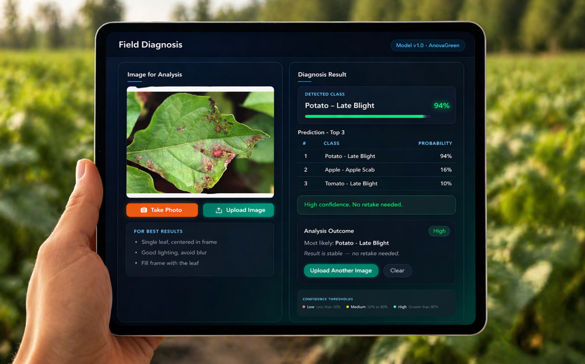

# Plant Disease Detection — Field Diagnosis Decision-Support System

A domain-shift-aware evaluation study paired with a working inference prototype. Models are trained on controlled lab images (PlantVillage) and benchmarked on real-world field images (PlantDoc) to identify strategies that survive the lab-to-field gap — the primary failure mode of deployed agricultural AI.

**6 model architectures · 13 training strategies · 164 evaluated runs · FastAPI + React MVP**

<p align="center">
  
  <br />
  <em>AnovaGreen Field Diagnosis — local MVP simulator</em>
</p>

**Supporting materials:** [Technical report](docs/plant_disease_detection_report.pdf) · [Slide deck](docs/plant_disease_detection_slide_deck.pdf)

---

## Why This Project Exists

Plant disease AI systems routinely achieve 98–99% accuracy in published benchmarks — then fail in the field. The reason is straightforward: training datasets like PlantVillage use clean, centered, well-lit studio images. Real farm conditions involve cluttered backgrounds, variable angles, inconsistent lighting, and partial leaf occlusion. A model that scores 99% on PlantVillage and 33% on field images is not a reliable tool — it is a liability.

This project treats that gap as the core engineering problem. It asks: **which model architectures and augmentation strategies produce the most robust performance when the deployment environment looks nothing like the training set?**

The answer informs a practical decision-support tool designed around the constraint that current model accuracy is not sufficient to replace human judgment — and should not try to.

---

## Business Problem and Decision Context

**Scenario:** An agronomist or field operator photographs a diseased leaf. They need to narrow down which disease they are likely dealing with — quickly, without access to a lab — in order to decide whether to apply a treatment, quarantine the crop, or escalate to a specialist.

**The challenge is not image classification. It is reliable triage under real conditions.**

A single model prediction at 45% macro F1 is not actionable on its own. But narrowing 26 possible diseases to 3 likely candidates — ranked by confidence, with a clear signal of when to trust vs. when to retake — turns an unreliable classifier into a useful first-pass diagnostic aid. The human retains the final decision; the model reduces the cognitive load.

This distinction shapes every design choice in this project, from how evaluation is structured to how results are surfaced in the UI.

---

## Solution Overview

The system has two complementary layers:

**1. Evaluation study** — A systematic comparison of 6 model architectures across 13 augmentation and training strategies, assessed on a held-out real-world test set. The goal is to identify which approaches transfer best from lab to field, and by how much.

**2. Inference prototype (AnovaGreen Field Diagnosis)** — A local web application that runs the best trained model and returns top-3 disease predictions with confidence bands and actionable user guidance. The system explicitly communicates uncertainty and prompts the user when confidence is low.

---

## Key Findings

**PlantVillage accuracy is not a useful metric for deployment decisions.**

Across all 164 runs, 91% achieved Macro F1 ≥ 0.97 on PlantVillage. This near-total saturation means PlantVillage cannot discriminate between a good and a mediocre model for real-world use. All meaningful comparisons use PlantDoc performance.

**PlantDoc is the more realistic deployment benchmark.**

On the field-condition test set, Macro F1 ranges from 0.08 to 0.45 across all runs — a 5× spread. The choice of architecture and training strategy matters enormously in practice, even when PlantVillage scores are nearly identical.

**Best results on PlantDoc (Macro F1), ranked by experiment:**

| Strategy | Best Architecture | PlantDoc Accuracy | PlantDoc Macro F1 |
|---|---|---:|---:|
| Perspective augmentation (zero-shot) | Swin-B | 0.48 | **0.45** |
| Style disentanglement | Swin-B | 0.47 | 0.42 |
| Baseline-LoRA | Swin-B | 0.43 | 0.38 |
| Random erasing + AdamW | ViT-B/16 | 0.41 | 0.37 |
| Rotation only | CCT-14 | 0.39 | 0.34 |
| Rotation + Gaussian blur | CCT-14 | 0.37 | 0.33 |
| Gaussian blur only | Swin-B | 0.36 | 0.33 |
| Affine | Swin-B | 0.37 | 0.32 |
| CutMix | Swin-B | 0.37 | 0.32 |
| Baseline (no augmentation) | MaxViT-B | 0.33 | 0.29 |

**Takeaways:**
- Perspective augmentation with a frozen backbone (zero-shot transfer) yields the best cross-domain generalization — the model is not overfit to PlantVillage texture patterns.
- Style disentanglement (subspace factorization separating style from content) is competitive without relying on a frozen backbone.
- LoRA fine-tuning outperforms all standard augmentation-only approaches, suggesting parameter-efficient methods are more than a compute optimization — they preserve backbone generalization.
- Swin-B dominates 8 of 13 experiments. CCT-14 is consistently strong for standard augmentation runs.

Full results: [`results_zip/report.md`](results_zip/report.md) · [`results_zip/master_results.csv`](results_zip/master_results.csv)

---

## MVP: AnovaGreen Field Diagnosis

The prototype demonstrates what a decision-support system built around honest model uncertainty looks like in practice.

**Upload a leaf image → receive top-3 disease candidates → act with appropriate confidence.**

### What the system does

- Accepts image upload or camera capture (JPEG, PNG, WebP)
- Returns top-3 disease predictions with probability scores across 26 disease classes
- Classifies confidence into three bands:
  - **High (≥ 80%):** Result is stable. No retake needed.
  - **Medium (50–80%):** Retake recommended. Try a closer, single-leaf photo.
  - **Low (< 50%):** Retake required. Use Top-3 to guide manual assessment.
- Displays actionable guidance based on confidence level
- Shows the model version and checkpoint used for traceability

### Why it is designed this way

At 0.45 Macro F1 on real-world images, the model is not accurate enough to serve as a single definitive answer. The system is deliberately designed to narrow 26 possible diseases to 3 likely candidates and communicate its own uncertainty. The farmer or agronomist uses local context — crop type, season, regional disease prevalence — to make the final call.

This is not a limitation to apologize for. It is the correct design for the current model capability.

### Running the simulator locally

See [`README_SIMULATOR.md`](README_SIMULATOR.md) for full setup. Summary:

**Backend (FastAPI):**
```bash
cd backend
pip install -r requirements.txt
uvicorn app.main:app --reload --host 0.0.0.0 --port 8000
```

**Frontend (React + Vite):**
```bash
cd frontend
npm install
npm run dev
# Opens at http://localhost:5173
```

**API endpoints:**

| Endpoint | Method | Description |
|---|---|---|
| `/health` | GET | Backend status and loaded model info |
| `/predict` | POST | Upload image, receive top-k predictions with confidence |

**Sample response:**
```json
{
  "model_version": "vit_base_patch16_224 | erasing_adamw | epoch=19 | val_acc=0.9987",
  "top1": { "label": "tomato__late_blight", "prob": 0.63 },
  "topk": [
    { "rank": 1, "label": "tomato__late_blight", "prob": 0.63 },
    { "rank": 2, "label": "tomato__early_blight", "prob": 0.18 },
    { "rank": 3, "label": "tomato__healthy", "prob": 0.09 }
  ],
  "warning": null
}
```

---

## Evaluation Approach

### Why PlantDoc is treated as a held-out deployment test

PlantDoc is never used for training, validation, or model selection during any experiment. It is a one-shot test of real-world generalization. This mirrors how production evaluation should work: the deployment environment is not a hyperparameter to optimize against.

### Why Macro F1, not accuracy

Accuracy on imbalanced multi-class problems masks poor performance on minority classes. Macro F1 weights all 26 disease classes equally, penalizing models that score well on common classes while ignoring rare ones. For a diagnostic support tool, a model that cannot detect an uncommon but serious disease is not an acceptable trade-off.

### Why evaluation design matters more than model choice

The most important methodological contribution of this project is not which model won — it is treating the evaluation correctly. Saturated training-set metrics are not informative. Cross-domain test performance on a realistic deployment proxy is. That distinction shapes which experiments are worth running and how results should be interpreted.

---

## Architecture and System Components

```
┌─────────────────────────────────────────────────────────┐
│                   AnovaGreen Field Diagnosis            │
│                                                         │
│  React Frontend (Vite)                                  │
│  ├── Image upload / camera capture                      │
│  ├── Confidence band display (High / Medium / Low)      │
│  ├── Top-3 ranked predictions                           │
│  └── Retake guidance and actionable outcomes            │
│                          │                              │
│                     HTTP/REST                           │
│                          │                              │
│  FastAPI Backend                                        │
│  ├── POST /predict  (multipart image → top-k results)   │
│  ├── GET  /health   (model status + version)            │
│  └── Inference module (timm transform → softmax → topk) │
│                          │                              │
│  ViT-B/16 Checkpoint                                    │
│  └── erasing_adamw_vit_base_patch16_224.pt (~550 MB)    │
└─────────────────────────────────────────────────────────┘
```

**Training pipeline:**

```
PlantVillage (source domain)
  └── Label harmonization (26 shared classes)
        └── Config-driven training (JSON per experiment)
              └── Evaluation on PV_Test + PlantDoc_Test
                    └── master_results.csv → report.md
```

**Models evaluated:**

| Architecture | Type | Unfrozen layers |
|---|---|---|
| MobileNetV3-Small | CNN | Fully trainable |
| EfficientNet-B0 | CNN | Fully trainable |
| ViT-B/16 | Transformer | Last 4 encoder blocks + head |
| Swin-B | Transformer | Last 2 stages + norm + head |
| MaxViT-B | Transformer | Last 1 stage + head |
| CCT-14/7x2 | Transformer | Last 2 blocks + classifier |

---

## Implementation Highlights

- **164 evaluated runs** across 13 experiments and 6 model families, all sharing a unified evaluation pipeline
- **Config-driven training** — each experiment is a JSON file specifying model, hyperparameters, and augmentation transforms, enabling reproducible runs without code changes
- **Label harmonization pipeline** — standardizes two datasets with different naming conventions into 26 shared disease classes (`scripts/make_index.py`, `apply_label_map.py`, `build_mapped_splits.py`)
- **FastAPI inference service** with model versioning, CORS, `/health` endpoint, and a smoke test script (`backend/scripts/smoke_test_predict.py`)
- **React + Vite frontend** with camera capture support (mobile environment detection, permission state handling), drag-and-drop upload, and confidence-aware UI components
- **Model integrity verification** — `model_manifest.json` contains the SHA256 hash of the checkpoint for reproducibility
- **Jupyter notebooks** — training walkthroughs, embedding EDA, and augmentation visualization (`src/jupyter_notebooks/`)
- **Formal report and slide deck** — supporting documentation for methodology, results, and system design (`docs/plant_disease_detection_report.pdf`, `docs/plant_disease_detection_slide_deck.pdf`)

---

## Repository Structure

```
plant-disease-detection/
├── backend/                  # FastAPI inference service
│   ├── app/main.py           #   REST API (health, predict)
│   ├── app/inference.py      #   Model loading and prediction
│   ├── assets/classes.json   #   26 class labels
│   └── assets/model_manifest.json  # Checkpoint metadata + SHA256
├── frontend/                 # React + Vite UI
│   └── src/
│       ├── components/       #   ImagePanel, ResultPanel, Header
│       └── api/predict.js    #   Backend API wrapper
├── src/
│   ├── train/train.py        # Unified training script
│   ├── eval/evaluate.py      # Evaluation on PV + PlantDoc test sets
│   ├── utils/                # Dataloaders, transforms, model factory, plotting
│   ├── cct/                  # CCT-14 model implementation
│   └── jupyter_notebooks/    # Training, EDA, augmentation notebooks
├── configs/                  # Per-experiment training configs (JSON)
│   ├── baselines/
│   ├── aug_erasing/
│   ├── aug_cutmix/
│   └── ...                   # (+ mixup, cutmixup, rotate, gaussian, affine, perspective)
├── scripts/                  # Data preparation pipeline
├── results_zip/              # Experiment results, master CSV, and report
├── docs/                     # README visuals and supporting documents
│   ├── assets/               
│   ├── plant_disease_detection_report.pdf
│   └── plant_disease_detection_slide_deck.pdf
└── requirements.txt
```

---

## Setup

### 1. Install dependencies

```bash
pip install -r requirements.txt
```

For CUDA-enabled PyTorch:
```bash
pip install -r requirements-pytorch.txt
```

### 2. Prepare data

Place raw datasets under `data/raw/` (see [`docs/milestones.md`](docs/milestones.md) for directory layout), then run the label harmonization pipeline:

```bash
python scripts/make_index.py
python scripts/apply_label_map.py
python scripts/build_mapped_splits.py
```

### 3. Train a model

```bash
python src/train/train.py --config configs/baselines/baseline_vit_base_patch16_224.json
```

### 4. Evaluate

```bash
python src/eval/evaluate.py \
  --model-path checkpoints/baseline/baseline_vit_base_patch16_224.pt \
  --model-name vit_base_patch16_224 \
  --output-file outputs/baseline_vit_base_patch16_224.csv
```

### 5. Run the Simulator MVP

See [`README_SIMULATOR.md`](README_SIMULATOR.md). The model checkpoint (~550 MB) is not stored in this repository. Obtain it separately and place it at:

```
results_zip/best_model/erasing_adamw_vit_base_patch16_224.pt
```

Verify integrity before use:
```bash
sha256sum results_zip/best_model/erasing_adamw_vit_base_patch16_224.pt
# Expected: 5776de5116ddbff02678e89ce52b2510e4fc50352729def449c81ae1abab2682
```

---

## Current Limitations

These are stated directly because they shape how the system should and should not be used.

- **Local-only deployment.** The Simulator MVP runs on localhost only. There is no hosted instance, cloud deployment, or public demo URL.
- **Checkpoint not stored in the repository.** The trained model weights (~550 MB) must be obtained separately. This is a practical constraint, not a feature.
- **Moderate PlantDoc ceiling.** The best result across all 164 runs is Macro F1 0.45 on real-world field images. This is a meaningful improvement over the unaugmented baseline (0.29), but it is not sufficient for autonomous diagnosis. Human-in-the-loop is not optional — it is a design requirement.
- **26 shared disease classes only.** The label harmonization between PlantVillage and PlantDoc yields 26 overlapping classes. Diseases present in one dataset but not the other are excluded.
- **CPU inference only** in the current Simulator configuration. Startup takes 10–20 seconds to load the ViT-B/16 checkpoint (~550 MB) into memory.

---

## Future Directions

- **Domain adaptation** — fine-tuning on a small labeled PlantDoc training split to reduce the lab-to-field gap directly
- **Cloud deployment** — containerized backend with model storage on object storage (S3 / GCS), enabling a shareable demo endpoint
- **Confidence calibration** — the current confidence bands use fixed thresholds; calibrated probabilities (temperature scaling, Platt scaling) would make confidence estimates more interpretable
- **Lightweight model path** — MobileNetV3 and EfficientNet-B0 are already present in the study; a quantized or pruned variant would enable on-device inference on mobile hardware
- **Grad-CAM visualization** — saliency maps overlaid on input images to show which leaf regions drive each prediction, improving interpretability for agronomist review

---

## Team

This was a collaborative team project spanning cross-domain benchmarking, model evaluation, and a local decision-support MVP.

---

## What This Project Demonstrates

**Real-world problem framing** — The project treats lab-to-field failure as the central deployment issue, rather than assuming high benchmark accuracy is enough.

**Evaluation discipline** — A held-out cross-domain test set, Macro F1 as the main decision metric, and 164 experiment runs make the findings more meaningful than a benchmark table alone.

**Decision-support thinking** — The prototype is designed to return a shortlist with clear confidence guidance, so the model supports human judgment rather than pretending to replace it.

**End-to-end applied AI execution** — The repo spans data preparation, model training, systematic evaluation, a local inference API, a React frontend, and formal documentation.

---

*Datasets are subject to their respective licenses and terms. Code is MIT licensed.*
